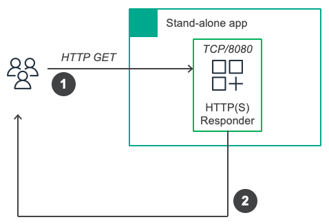
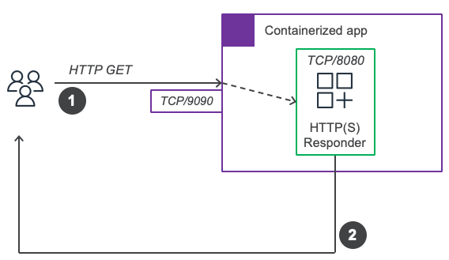
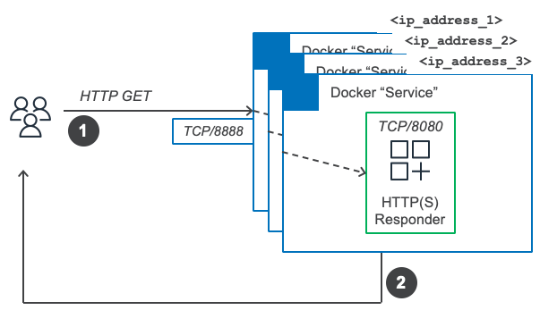
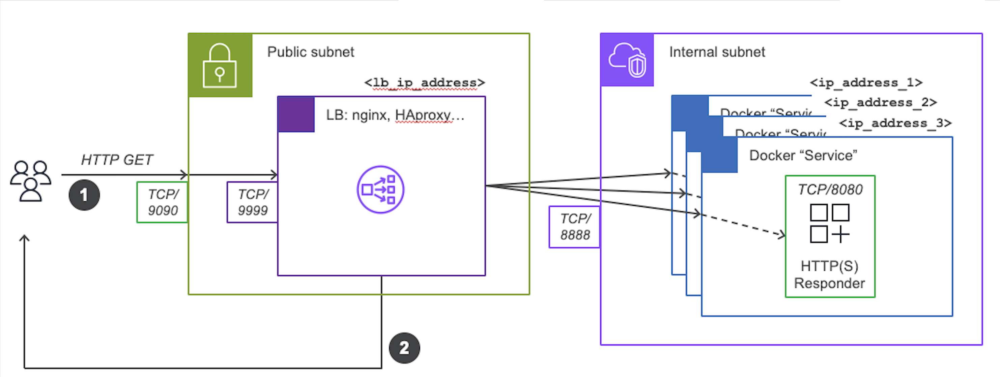

# GoWeb
A simple HTTP responder, written in Go.

File `goweb.go` contains the code that is to be compiled and run by means of containers.</br>
The source code describes two functions:
1. `main()`: listens and servers any HTTP GET requests on port 8080 (`listenPort`)
2. `sayHello()`: returns a message saying `This is <hostname> running on <OS/arch> saying: <received_message>`

### Local test


Run as `go run goweb.go`. From a different terminal tab, run the following:
```
$ curl http://127.0.0.1:8080/Hello%20there\!
This is <hostname> running on linux/amd64 saying: Hello there!
```

----

### Build and run as container


- build
```
$ docker buildx build --tag <repository>/<name>:<tag> .
```
**NOTE**: mind the dot ("`.`") at the end of the command above

- run
```
$ docker run \
  --detach \
  --publish published=9090,target=8080 \
  --name goweb \
  <repository>/<name>:<tag>
```

- test
```
$ curl http://<private_subnet_ip_address>:9090/Hello%20there\!
This is <hostname> running on linux/amd64 saying: Hello there!
```
**NOTE**: the published port (`9090`) is different from the listening port (`8080`)

### Run with Docker Swarm


- run
```
$ docker service create \
  --replicas 3 \
  --name goweb \
  --publish published=8888,target=8080 \
  <repository>/<name>:<tag>
```

- test
```
$ curl http://<private_subnet_ip_address>:8888/Hello%20there\!
This is <hostname> running on linux/amd64 saying: Hello there!
```

#### To scale up/down
```
$ docker service scale goweb=5
```
**NOTE**: the numbers `3` and `5` above are only examples

----

### Add a load balancer (`nginx`)


Take a look and edit as appropriate file `data/loadbalancer/default.conf`. The file defines:</br>
- `backend`: the servers (private subnet IP addresses) and ports on which the service is offered
- `listen`: the port on which the LB operates (within the container)

- run
```
docker run \
  --detach \
  --name loadbalancer \
  --mount type=bind,source=./data/loadbalancer,target=/etc/nginx/conf.d \
  --publish published=9090,target=9999 \
  nginx
```

- test
```
$ curl http://<private_subnet_ip_address>:9090/Hello%20there\!
This is <hostname> running on linux/amd64 saying: Hello there!
```

----

See also: [https://www.digitalocean.com/community/tutorials/how-to-make-an-http-server-in-go](https://www.digitalocean.com/community/tutorials/how-to-make-an-http-server-in-go)
